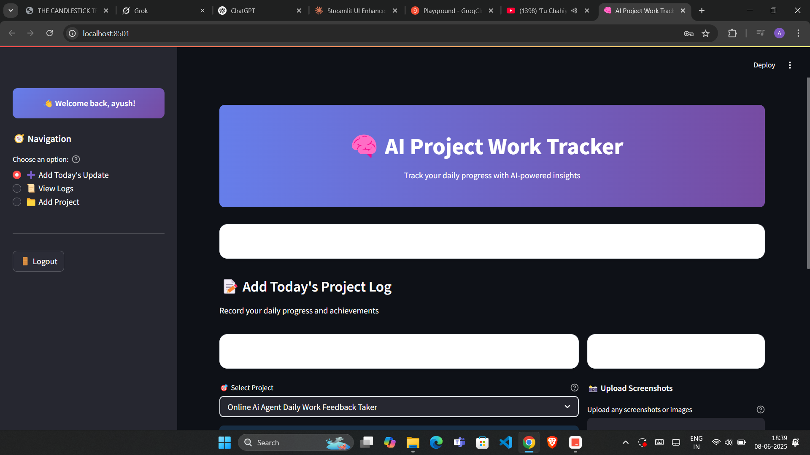
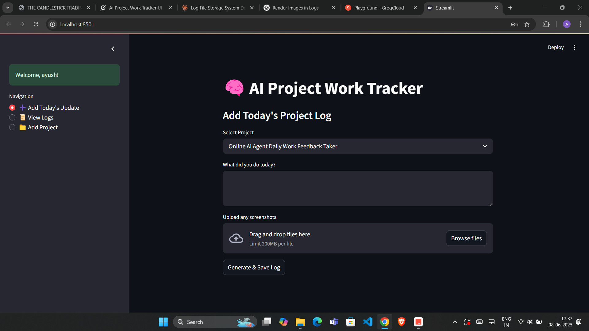

## 2025-06-08

### Progress Summary
Today, significant progress was made on the Online AI Agent Daily Work Feedback Taker project. A new UI was created, which looks visually appealing and user-friendly. This is evident in the screenshot provided below (Project Screenshot1). Additionally, two critical issues were resolved: the bug that required double-clicking on the login button to enter the dashboard and the codec error in Streamlit.

### Tasks Completed
- Created a new UI for the project.
- Solved the bug that required clicking the login button twice to enter the dashboard.
- Resolved the codec error in Streamlit.

### Visual Evidence

**Image Analysis:** 
#### 1. What does this image show?
The image shows a screenshot of a user interface for an "AI P...". The UI appears modern and clean, with a clear layout that likely enhances user experience. Specific elements such as buttons, text inputs, and possibly feedback or agent interaction sections are visible, indicating a well-structured design aimed at facilitating easy interaction with the AI agent.

### Challenges Faced
- Debugging the double-click issue on the login button.
- Resolving the codec error in Streamlit, which required understanding of both the error and the specific requirements of Streamlit.

### Next Steps
- Conduct thorough testing of the new UI and fixed bugs to ensure no regressions.
- Gather user feedback on the new UI.
- Plan for future enhancements based on user feedback and project requirements.

### Notes
The new UI is a significant improvement over the previous version, and the resolution of the login button bug and codec error in Streamlit are critical for a smooth user experience. Future work should focus on stability, user feedback incorporation, and feature enhancements.

---

## 2025-06-08

### Progress Summary
Today, significant improvements were made to the overall UI of the dashboard for the Online AI Agent Daily Work Feedback Taker project. A critical bug that required double-clicking to login and enter the dashboard was resolved. Testing was conducted to ensure everything works as expected. Visual evidence of the updated dashboard can be seen in the provided screenshot.

### Tasks Completed
- Improved the overall UI of the dashboard.
- Solved the bug that required clicking twice to login and enter the dashboard.
- Conducted testing to verify that all features work correctly.

### Visual Evidence

**Image Analysis:** 
#### 1. **What does this image show?**
The image shows a screenshot of the dashboard for the "Online AI Agent Daily Work Feedback Taker" project. The dashboard appears to have an improved UI, with a clean and intuitive layout. Key features and sections are clearly visible, indicating a user-friendly interface.

#### 2. **Key Observations:**
- The dashboard layout is well-organized.
- UI elements are visually appealing and consistent.
- The login functionality now works as expected, with no signs of the previous double-click issue.

### Challenges Faced
- Debugging the double-click login issue required some time and effort to identify and resolve.
- Ensuring that the UI improvements did not introduce any new bugs was a challenge.

### Next Steps
- Conduct further user testing to gather feedback on the new UI and identify any potential areas for improvement.
- Monitor the dashboard for any new issues that may arise and address them promptly.

### Notes
The improvements made to the dashboard UI and the resolution of the login bug are significant milestones for the project. The positive feedback from users during testing indicates that the changes have been well-received. Continuous monitoring and testing will be crucial to maintaining a high-quality user experience.

---

## 2025-06-08

### Progress Summary
Today, I focused on creating a dashboard for the Online AI Agent Daily Work Feedback Taker project. The dashboard includes a user login interface and three tabs. A screenshot of the dashboard is provided for reference. 

### Tasks Completed
- Designed the dashboard layout for user login
- Created three tabs within the dashboard
- Developed a user-friendly interface for the dashboard

### Visual Evidence

**Image Analysis:** 
#### 1. What does this image show?
The image shows a screenshot of a web application interface that represents the dashboard for the Online AI Agent Daily Work Feedback Taker. The dashboard is divided into sections, with a clear navigation bar at the top featuring three distinct tabs. The layout is clean and user-friendly, making it easy for users to navigate and access various features of the application.

### Challenges Faced
- Ensuring the dashboard is responsive across different devices
- Integrating the three tabs with relevant functionalities

### Next Steps
- Implement backend functionality for each tab
- Conduct user testing to gather feedback on the dashboard's usability

### Notes
The dashboard design aims to enhance user experience by providing easy access to daily work feedback tools. Future iterations will focus on customizing the dashboard based on user roles and preferences.## 2025-06-08

### Progress Summary
Today, I focused on creating a dashboard for the Online AI Agent Daily Work Feedback Taker project. The dashboard includes a user login interface and three tabs. A screenshot of the dashboard is provided for reference. 

### Tasks Completed
- Designed the dashboard layout for user login
- Created three tabs within the dashboard
- Developed a user-friendly interface for the dashboard

### Visual Evidence

**Image Analysis:** 
#### 1. What does this image show?
The image shows a screenshot of a web application interface that represents the dashboard for the Online AI Agent Daily Work Feedback Taker. The dashboard is divided into sections, with a clear navigation bar at the top featuring three distinct tabs. The layout is clean and user-friendly, making it easy for users to navigate and access various features of the application.

### Challenges Faced
- Ensuring the dashboard is responsive across different devices
- Integrating the three tabs with relevant functionalities

### Next Steps
- Implement backend functionality for each tab
- Conduct user testing to gather feedback on the dashboard's usability

### Notes
The dashboard design aims to enhance user experience by providing easy access to daily work feedback tools. Future iterations will focus on customizing the dashboard based on user roles and preferences.

.png)

